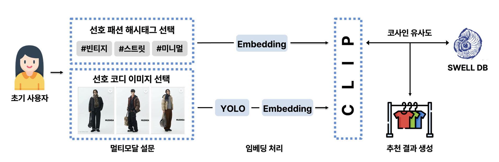
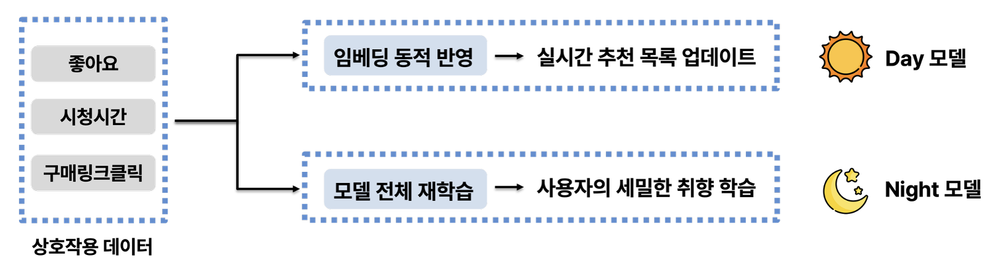
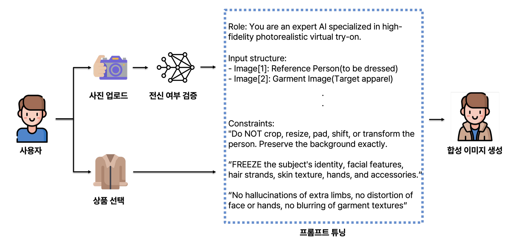

<div align="center">


# SWELL: Find Your Shell

**A Swipe-Based Personalized Fashion Recommendation & Virtual Fitting Platform**

🏆 **Winner of the New Challenge Award (Creative Category) at HCIK (2026.2)**

[](https://nextjs.org/)
[](https://reactjs.org/)
[](https://fastapi.tiangolo.com/)
[](https://www.python.org/)
[](https://www.postgresql.org/)
[](https://aws.amazon.com/)
[](https://deepmind.google/technologies/gemini/)

<br>

[](https://youtu.be/VBz_uec8q7k)

</div>

---

## Overview

**SWELL** is a Human-Computer Interaction (HCI) informed fashion exploration platform that makes discovering your perfect style as easy as swiping on your smartphone. By dynamically analyzing user body types, personal preferences, and real-time browsing interactions, SWELL provides a highly tailored fashion experience.

### Core Features & Architecture

**1. Swipe-Based Fashion Exploration**  
Effortlessly browse through outfit recommendations using an intuitive, Tinder-like swipe interface (Like / Skip).

**2. Personalized Recommendation System**  
An intelligent, LLM-powered backend engine curates outfits based on your unique style tags, past interactions, and virtual closet. To provide an optimal experience regardless of interaction history volume, SWELL divides its core recommendation pipeline into two distinct algorithmic phases:

- 🧊 **Cold Start (Multimodal Survey & CLIP):** New users complete a quick survey (*Images* & *Hashtags*). Photos are verified via **MediaPipe Pose** (ensuring full-body visibility), embedded with **CLIP**, and matched against the DB to jump-start the initial feed.
  <br>
  
  <br>

- 🔥 **Warm Start (Day-Night Hybrid Pipeline):** Decouples a user's *daily mood* from their *overall taste*:
  - ☀️ **Day Model (Fast Update):** Freezes base weights and instantly updates user embeddings based on real-time behavior (Likes, skips, clicks) to reflect today's preference.
  - 🌙 **Night Model (Base Retraining):** Utilizes **NeuMF** to run heavy batch retraining every night using accumulated interaction history, deeply learning fashion tastes.
  <br>
  
  <br>

**3. Virtual Fitting**  
Experience how clothes look on you before making a purchase utilizing state-of-the-art virtual try-on models and integrations.
  <br>
  

<br>

## Tech Stack

### AI / ML Model
- **Fashion Item Embedding (YOLO & CLIP):** Employs **YOLO** for precise image data preprocessing (detecting and isolating fashion items/figures), then transforms this multimodal data (images, text) into a unified vector space via **CLIP** for highly accurate item similarity retrieval.
- **Recommendation Engine (NeMF):** Neural Matrix Factorization technique to deeply analyze user-item interaction histories and compute personalized preference probabilities.
- **Data Pipeline & Preprocessing:** Base datasets sourced natively from **Musinsa**. Includes rigorous parsing, style categorizations, and regular database syncs via batch scripts and real-time updates.
- **Virtual Fitting Engine (NanoBanana):** Serves as the primary synthesis engine orchestrating the virtual try-on process. It applies strict constraints through prompt tuning to generate high-fidelity, photorealistic images while preserving the user's original identity and background.
- **Virtual Fitting Evaluation (LLM):** Utilizes large language models (e.g., Gemini) to qualitatively and quantitatively evaluate the performance of the generated virtual fitting results, ensuring synthesis quality and rule adherence.

### Infrastructure
- **Server Environment:** 100% **AWS** powered ecosystem guaranteeing robust network security and high availability for both stateless algorithms and relational databases. 
- > *(Note: The service is currently configured to run strictly on **local environments** for development and demonstration purposes.)*

### Frontend
- **App:** Next.js 16 (React 19), App Router, Tailwind CSS v4.
- **UX Specifics:** Framer Motion & React-Swipeable to deliver interactive, Tinder-like smooth swipe experiences.

### Backend
- **Core APIs:** FastAPI asynchronously orchestrates AI sub-services, database interactions, and user authentications.
- **Database:** PostgreSQL modeled via SQLAlchemy.

<br>

## Repository Structure

```text
SWELL/
├── frontend/           # Next.js Web Application
│   ├── src/app/        # App Router pages and layouts
│   ├── src/components/ # Reusable React components (UI, Swipeable cards)
│   └── package.json    # Frontend dependencies and scripts
│
├── backend/            # FastAPI Recommendation Server
│   ├── app/            # Main application logic (API routers, services, models)
│   ├── data/           # Seed data and JSON datasets (outfits, tags)
│   ├── scripts/        # Batch scripts for data loading and embedding updates
│   └── requirements.txt
│
├── data/               # Deprecated/Legacy directory (previously for standalone recommendation modeling)
└── .assets/            # Hidden directory containing image assets for README
```

<br>

## Getting Started

SWELL is composed of separated frontend and backend services. Please refer to each directory's documentation for detailed setup instructions.

### 1. Backend Setup
Navigate to the `backend/` directory to set up the Python virtual environment, install dependencies, configure your environment variables, and ensure a running PostgreSQL instance.
```bash
cd backend
python3.11 -m venv .venv
source .venv/bin/activate
pip install -r requirements.txt
uvicorn main:app --host 0.0.0.0 --port 8000 --reload
```
**For detailed instructions, see the [Backend README](./backend/README.md)**

### 2. Frontend Setup
Navigate to the `frontend/` directory to install Node packages and spin up the Next.js development server.
```bash
cd frontend
npm install
npm run dev
```
**The web app will be available at `http://localhost:3000`. For detailed instructions, see the [Frontend README](./frontend/README.md).**

<br>

## Contributing
*This project was developed for an HCI (Human-Computer Interaction) curriculum at **Hanyang University** and received the **New Challenge Award (Creative Category)** at the **HCIK (2026.2)** (HCI Society of Korea) conference.*