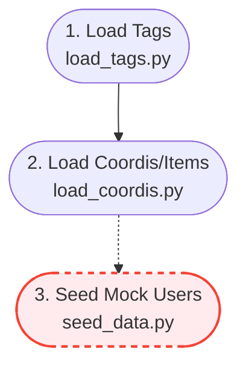
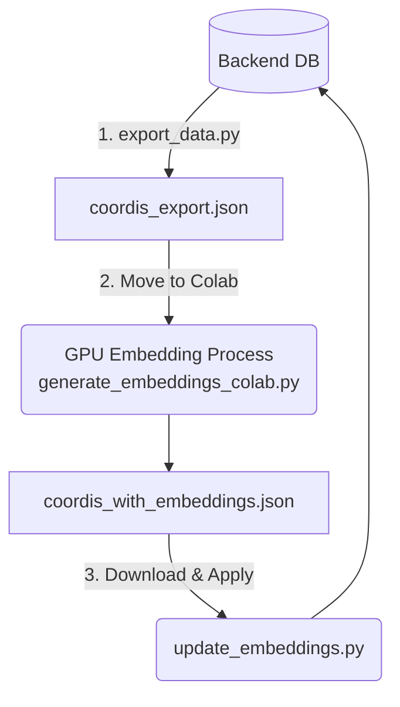

# SWELL Scripts Pipeline

All scripts must be executed within the `backend` directory after activating the virtual environment (`.venv`) and ensuring the database is running.

## 1. Data Injection Process
Sets up the base data and test environments for the DB. Due to database foreign key constraints, **you must execute them strictly in the following order**.

**① Inject Tag Data (`load_tags.py`)**
*   **Command:** `python scripts/load_tags.py data/final_data_tags.json`
*(Note: Replace `final_data_태그.json` with your actual filename if translated)*

**② Inject Coordi/Item Data (`load_coordis.py`)**
*   **Command:** (Execute for both Male/Female data)
    *   `python scripts/load_coordis.py data/final_data_men.json`
    *   `python scripts/load_coordis.py data/final_data_women.json`
*   **⚠️ Caution:** This process may take a while due to the large volume of clothing data.

**③ Inject Mock Users for Testing (`seed_data.py`)**
*   **Command:** `python scripts/seed_data.py`
*   **⚠️ Caution:** For LOCAL testing only! **NEVER run this in a production DB**, as it will corrupt the recommendation algorithm with fake user interactions.

---

## 2. Embedding Process
Pipeline to process AI recommendation inputs using external GPU resources. (Proceed to this step ONLY after completing Step 1)

**① Extract Database Data (`export_data.py`)**
*   **Command:** `python scripts/export_data.py`
*   **Description:** Extracts required metadata from your local DB and outputs `coordis_export.json`.

**② Execute GPU Embedding (`generate_embeddings_colab.py`)**
*   **Command:** Run script inside Google Colab environment.
*   **Description:** Upload `coordis_export.json` to Colab, execute parallel heavy embedding computation, and retrieve the output file `coordis_with_embeddings.json`.

**③ Update DB with Embeddings (`update_embeddings.py`)**
*   **Command:** `python scripts/update_embeddings.py path/to/coordis_with_embeddings.json`
*   **Description:** Pushes the finalized vector data from Colab directly into the backend DB's `description_embedding` column.

---
**⚠️ Common Warnings**
*   Ensure all target JSON files are placed properly within the `backend/data/` directory.
*   Verify that your `.env` file correctly defines the `DATABASE_URL` variable before running any script.
