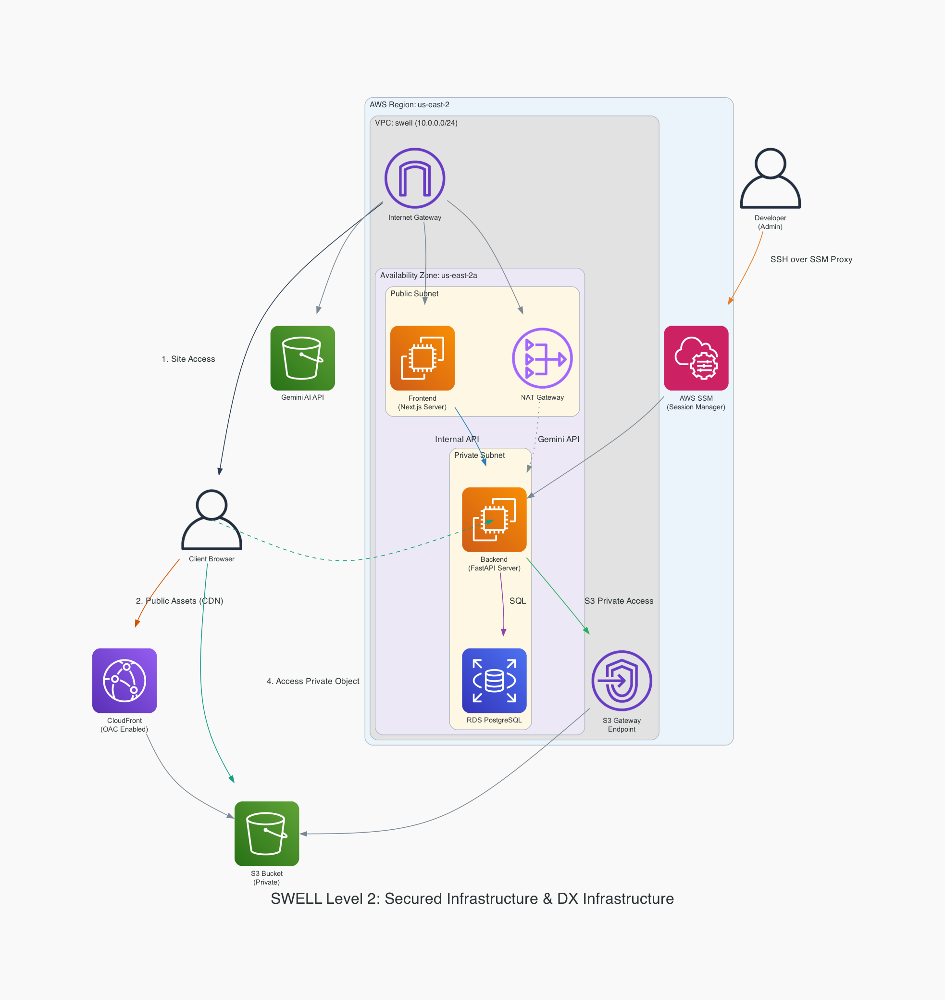
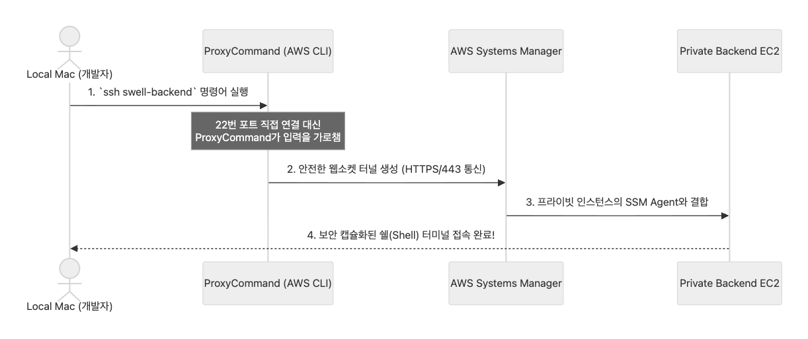

# SWELL Level 2 배포 가이드: 보안 및 DX 개선

> **목적:** Level 1의 프라이빗 서브넷 아키텍처를 유지하면서, S3 스토리지의 보안과 성능을 개선하고 개발자 환경(Developer Experience, DX)을 위한 설정을 추가한다.
> **아키텍처 다이어그램:** [level2.py](./level2.py)에서 생성된 `level2_architecture.png` 참조.
> **핵심 변경 사항:** 
> 1. SSM ProxyCommand를 활용한 프라이빗 EC2 직접 접속 환경 구축
> 2. S3 VPC Gateway Endpoint 및 IAM 역할 기반 인증 도입
> 3. CloudFront OAC를 통한 퍼블릭 데이터 캐싱 최적화
> 4. Pre-signed URL을 활용한 프라이빗 데이터 접근 제어 강화



> [!TIP]
> Level 2는 기존 Level 1 인프라의 설정을 변경하는 과정이 포함되어 있다. 특히 S3 정책이나 IAM 권한 변경 시 애플리케이션의 로직 수정을 동반하므로, 각 단계마다 서버 로그와 콘솔을 통해 정상 동작 여부를 확인해야 한다.

> [!IMPORTANT]
> 본 가이드는 **[Level 1 배포 가이드](../level1/LEVEL_1_DEPLOYMENT_GUIDE.md)**의 인프라 구성을 기초(Baseline)로 한다. 명시되지 않은 기본 리소스 생성 절차(VPC, Subnet, RDS 생성 등)는 Level 1과 동일하게 수행하며, 아래 표는 Level 1 각 단계별로 Level 2에서 수정되거나 확장된 사항을 요약한 가이드 맵이다.

| Level 1 단계 (Phase) | Level 2 변경 및 확장 사항 | 관련 항목 |
| :--- | :--- | :--- |
| **0: IAM 구성** | **[수정]** EC2 역할에 `AmazonS3FullAccess` 정책 조기 반영 | Phase 1-2 |
| **1: VPC/Subnet** | **[수정]** S3 VPC Gateway Endpoint 생성 여부 점검 및 연동 | Phase 1-1 |
| **1.5: 보안 그룹** | **[유지]** 기존 통신 정책 유지 (8000/5432 등 포트 격리) | - |
| **2: RDS 생성** | **[유지]** 프라이빗 서브넷 배포 원칙 유지 | - |
| **2.5: S3/IAM** | **[확장]** CloudFront OAC 및 Pre-signed URL 보안 레이어 도입 | Phase 2, 3 |
| **3: 백엔드 배포** | **[수정]** SSM ProxyCommand 접속 환경 및 Access Key 제거 로직 | Phase 0, 1-2 |
| **4~6: 배포 완료** | **[유지]** 데이터 주입 및 프론트엔드 배포 절차 동일 수행 | - |

---

## Phase 0: 사전 준비 - 프라이빗 EC2 접속 환경 개선

> [!NOTE]
> **목표:** 프라이빗 서브넷에 위치한 백엔드 EC2 접속 시마다 세션 매니저 웹 콘솔을 실행해야 했던 과정을 개선한다. 로컬 PC에서 `ssh swell-backend` 명령어 및 **VS Code Remote-SSH**를 통해 즉시 접속할 수 있도록 로컬 SSH 설정을 최적화한다.

### 0-1. 사전 준비물 설치 (Mac 로컬 환경)
- **내용:** 로컬 Mac 환경에서 서버에 원격으로 제어 명령을 내릴 수 있는 **AWS CLI**를 설치하고, 로컬 TCP와 웹소켓 간 세션을 중계할 수 있도록 **추가 플러그인(Session Manager Plugin)**을 설치해야 한다.
- **실행 명령어:**
  ```bash
  # 1. AWS CLI 설치
  brew install awscli
  
  # 2. Session Manager CLI 플러그인 설치
  brew install --cask session-manager-plugin
  ```

### 0-2. AWS CLI 자격 증명(Access Key) 연동
- **내용:** 로컬 환경이 AWS API를 호출하여 접속 세션을 생성할 수 있도록 인증 정보를 설정한다.
- **실행 명령어:** `aws configure`
  - **AWS Access Key ID:** IAM 사용자의 Access Key 입력
  - **AWS Secret Access Key:** IAM 사용자의 Secret Access Key 입력
  - **Default region name:** `us-east-2` 
  - **Default output format:** `json`

### 0-3. SSM ProxyCommand의 구성 및 원리
- **내용:** `ProxyCommand`를 사용하여 `ssh` 통신 시 22번 포트 직접 연결 대신 AWS CLI의 세션 매니저를 통해 통신을 중계하도록 설정한다.
- **이유:** 프라이빗 서브넷의 인스턴스는 공인 IP가 없으므로 직접 접근이 불가능하다. AWS의 보안 웹소켓 터널을 통해 통신을 캡슐화하여 전달함으로써 22번 포트를 외부로 노출하지 않고도 안전하게 접근할 수 있다.

### 0-4. 로컬 `~/.ssh/config` 설정

> **아키텍처 스니펫 (통신 흐름)**


- **내용:** `~/.ssh/config` 파일을 편집하여 아래 설정을 추가한다.

> [!IMPORTANT]
> `--target` 파라미터 값에는 반드시 접속하려는 **실제 백엔드 EC2의 인스턴스 ID(`i-xxxxxxxxxxxxxxxxx`)**를 입력해야 한다.

- **설정 예시:**
  ```ssh-config
  Host swell-backend
      # 1. AWS CLI 세션 매니저를 통한 통신 중계 설정
      ProxyCommand aws ssm start-session --target i-0abcd1234567890ef --document-name AWS-StartSSHSession --parameters "portNumber=%p"
      
      # 2. 접속 사용자 및 SSH 키 설정
      User ubuntu
      IdentityFile ~/.ssh/swell-backend-key.pem
      
      # 3. 최적화: 유휴 세션 끊김 방지(60초 핑)
      ServerAliveInterval 60
  ```

---

## Phase 1: S3 통신 최적화 및 인증 방식 개선 (VPC Gateway Endpoint)

> [!NOTE]
> **목표:** 백엔드 서버가 인터넷망(NAT Gateway)을 거치지 않고 S3와 직접 통신하도록 경로를 최적화하고, IAM 역할을 활용하여 환경 변수 내 Access Key 사용을 배제한다.

### 1-1. S3 VPC Gateway Endpoint 추가 및 점검
- **What:** 대규모 미디어 로드/업로드 시 비싼 NAT 트래픽 요금을 물지 않게 AWS 내부 통신으로 데이터를 돌려버리는 S3 전용 무료 라우팅 터널이다.
- **How (생성 시점):** **초기 커스텀 VPC를 생성하는 단계**에서 동시에 추가하여 구성하는 것을 권장한다.
- **확인 절차:**
  1. AWS VPC 콘솔 좌측 메뉴 **엔드포인트(Endpoints)**에서 유형이 `Gateway`로 설정된 `s3` 엔드포인트 존재 확인.
  2. 하단의 **라우팅 테이블(Route Tables)** 탭을 통해 백엔드가 존재하는 **프라이빗 서브넷 라우팅 테이블**이 리스트업되어 명시적으로 연결되어 있는지 점검.

### 1-2. IAM 인스턴스 프로파일 적용 및 Access Key 제거
- **What:** EC2 **인스턴스 생성 시점**부터 **`AmazonS3FullAccess` 권한 영역이 포함된** IAM 역할(`swell-backend-role`)을 적용한다. 이후, 백엔드 환경 변수(`.env`)의 `AWS_ACCESS_KEY_ID`와 `AWS_SECRET_ACCESS_KEY` 를 삭제한다.
- **Why:** Git에 키가 유출되거나, 서버 해킹으로 환경 변수가 탈취되더라도 반영구적인 슈퍼 키가 털리는 근본적인 보안 대형 사고를 차단할 수 있다.
- **수행 내용:**

| 순서 | 작업 항목 | 설명 |
| :---: | :--- | :--- |
| **1** | **IAM 역할 확인** | EC2 인스턴스에 할당된 IAM 역할에 **`AmazonS3FullAccess`** 정책이 포함되어 있는지 확인한다. |
| **2** | **코드 로직 점검** | `storage.py` 등에서 Access Key 파라미터가 없을 경우 `boto3`가 자동으로 인스턴스 메타데이터의 IAM 역할을 사용하도록 구성되었는지 확인한다. |
| **3** | **환경 변수 초기화** | 서버의 `.env` 파일에서 `AWS_ACCESS_KEY_ID` 및 `AWS_SECRET_ACCESS_KEY` 항목을 삭제한다. |
| **4** | **서비스 재시작** | `sudo systemctl restart swell-backend`를 실행한 후, 로그를 통해 인증 에러 발생 여부를 확인한다. |

> **코드 구성 예시 (`backend/app/core/storage.py`)**
> 
> 환경 변수 유무에 따라 IAM 방식과 로컬 테스트 방식을 호환하도록 설계한다. (이미 구현됨)
> ```python
> if aws_access_key_id and aws_secret_access_key:
>     # 로컬 개발용: 하드코딩된 Key를 통한 인증
>     self.s3_client = boto3.client('s3', aws_access_key_id=..., aws_secret_access_key=...)
> else:
>     # 운영 환경용: IAM Role(Instance Profile)을 통한 자동 인증 
>     self.s3_client = boto3.client('s3')
> ```

---

## Phase 2: 퍼블릭 데이터 전역 캐싱 (CloudFront OAC) (구현하지 않아도 됨)

> [!NOTE]
> **목표:** S3 버킷의 퍼블릭 액세스를 차단하고 CloudFront를 통해서만 정적 파일이 전송되도록 설정한다.
> **용도 정의:** 사용자 민감 정보는 Phase 3의 Pre-signed URL로 관리하며, 본 단계는 코디 이미지, 아이템 썸네일 등 **퍼블릭 데이터의 전송 속도 개선 및 비용 절감**을 목적으로 한다.

### 2-1. CloudFront 및 OAC 설정
- **내용:** S3 버킷을 원본(Origin)으로 지정하고 **OAC(Origin Access Control)**를 설정하여 CloudFront를 통해서만 S3에 접근할 수 있도록 제한한다.
- **설정 항목:**
  - **원본 도메인:** 해당 S3 버킷 선택
  - **원본 액세스:** `Origin access control 설정` 선택 및 신규 제어 설정 생성
  - **WAF:** 비용 관리를 위해 초기 구축 시에는 비활성화를 고려한다.

### 2-2. S3 버킷 정책 업데이트
- **내용:** S3 버킷의 퍼블릭 액세스를 차단하고 CloudFront OAC 요청만을 허용하는 정책을 적용한다.
- **수행 절차:**
  1. 버킷의 **퍼블릭 액세스 차단** 설정을 모두 **활성화(ON)**한다.
  2. 복사한 CloudFront 전용 정책(JSON)을 버킷 정책에 붙여넣는다.

> [!TIP]
> **CDN 정적 파일 보안 철칙 (UUID명 생성 팁) (이미 구현됨):** 
> CDN 배포를 했다지만 파일 도메인을 짐작하기 쉬운 명칭(가령 `1.jpg` `jang-profile.jpg`)으로 사용할 경우, 단순 주소줄 예측 크롤링 공격 모델에 모두 털릴 위험이 여전하다. 따라서 백엔드 업로드(Write) 시 애초부터 **`550e8400-e29b-0000.jpg` 같은 타겟 랜덤 난수 UUID 파일명** 형태로 강제 발급하여 DB에 맵핑하는 규칙을 무조건 고수해야 기초 방어망이 성립된다.

---

## Phase 3: 프라이빗 데이터 보안 강화 (S3 Pre-signed URL)

> [!IMPORTANT]
> **목표:** 사용자의 원본 사진 등 외부 노출을 엄격히 통제해야 하는 데이터 (사용자의 가상 피팅 사진 등) 에 대해, 백엔드에서 인증된 경우에만 임시 접근 권한을 부여하는 **Pre-signed URL** 체계를 도입한다.

### 3-1. S3 버킷 보호 설정
- **내용:** S3 콘솔에서 버킷의 모든 퍼블릭 액세스가 차단된 상태인지 재확인한다.
- **이유:** 인가된 경로(임시 URL) 외의 모든 직접적인 접근을 원천적으로 차단하기 위함이다.

### 3-2. 백엔드 처리 프로세스 개편

- **기존 방식의 문제점 (Public URL):**
  - **백엔드/프론트엔드 처리:** 기존에는 사용자의 '프로필 사진'이나 '가상 피팅 시착 원본 사진'을 S3에 업로드한 직후, 누구나 접근 가능한 **절대 경로(Public URL, 예: `https://...amazonaws.com/...`)을 생성하여 그대로 DB에 저장**했다. 프론트엔드는 이 주소를 응답받아 그대로 `` 태그에 렌더링했다.
  - **보안 취약점:** 프론트엔드 개발은 편했지만, **해당 URL 주소 문자열만 탈취당하면 토큰이 없거나 제3자인 누구라도 인가 없이 브라우저에서 내 민감한 사진들을 영구적으로 들여다 볼 수 있는 심대한 데이터 노출 위험**이 존재했다.

- **개선 방식 (Pre-signed URL):** 
  - **저장 구조 변경:** DB에는 파일의 절대 경로 대신 S3의 **Object Key(`users/uid/1.png`)**만을 저장한다.
  - **상위 API 로직 수정 (이미 구현됨):** DB에서 꺼낸 Object Key는 그대로 프론트엔드에 전달할 수 없다. 따라서 `users`, `virtual_fitting` 등 실제 데이터를 응답하는 API 서비스 레이어에서 `storage.get_presigned_url()`을 호출하여 **응답 직전에 유효한 URL로 변환하는 과정**이 추가되어야 한다. 
  - **이유:** DB에 저장된 값은 시스템 내부 경로일 뿐이며, S3 서비스가 프라이빗으로 전환되었기 때문에 이 경로를 서명된 URL로 교체해주어야만 브라우저가 이미지를 렌더링할 수 있기 때문이다.
  - **동적 발급:** 데이터 조회 요청 시 백엔드가 사용자의 권한을 검증한 후, 유효 시간이 제한된(예: 6분) 임시 접근 링크를 즉석에서 생성해 제공한다.
  - **동작 원리:** 설정된 만료 시간이 경과하면 해당 URL은 즉시 무효화되어 접근이 거부된다.
  - **결론적 무결성:** 만료 시간이 단 1초라도 초과된 링크는 AWS 스토리지 단에서부터 접근을 `Access Denied` 시켜버리므로, URL이 웹 상에 노출되거나 해커가 캐시를 가로채더라도 안전하다.

### 3-3. 핵심 코드 변경 사례 (`storage.py`)

로직을 구현하기 위해 백엔드의 최하단 스토리지 추상화 계층을 어떻게 고쳤는지가 핵심이다.

> **Before (기존 취약 로직):** 무비판적인 Public URL 고정 반환
> ```python
> # backend/app/core/storage.py
> async def upload(self, file: UploadFile, path: str) -> str:
>     # 파일 S3 업로드 로직 ...
>     
>     # 문제원인: 파일이 영구적으로 노출되는 URL을 만들어서 던져줌
>     return f"https://{self.bucket_name}.s3.{self.region}.amazonaws.com/{s3_path}"
> ```
> 
> **After (보안 개편 로직):** DB 보존용 Object Key 반환 및 즉석 서명 발급기 분리
> ```python
> # backend/app/core/storage.py
> async def upload(self, file: UploadFile, path: str) -> str:
>     # 파일 S3 업로드 로직 ...
>     
>     # 1번 변경: URL 대신 오직 파일 경로인 Object Key만 DB로 리턴
>     return s3_path
> 
> # 2번 변경: (신설) 조회 호출이 들어올 때마다 일회용 임시 서명 URL 동적 생성
> def get_presigned_url(self, object_key: str, expires_in: int = 360) -> str:
>     # AWS IAM 증명을 거쳐 설정된 시간(기본 360초) 한정 임시 권한 URL 발급
>     return self.s3_client.generate_presigned_url(
>         'get_object',
>         Params={'Bucket': self.bucket_name, 'Key': object_key},
>         ExpiresIn=expires_in
>     )
> ```

---

## Phase 4: Next — Infrastructure as Code (IaC) (Level 3 예정)

> [!NOTE]
> Level 2까지의 과정을 통해 보안과 성능이 최적화된 수동 배포 아키텍처를 완성했다. 다음 단계(Level 3)에서는 이 모든 인프라 구성 과정을 자동화하고 코드로서 관리하기 위해 **Terraform(테라폼)**을 도입할 예정이다.

- [ ] **Terraform 환경 구성** — 리소스 생성의 실수를 방지하고 인프라 형상 관리를 시작한다.
- [ ] **기존 리소스 Import 및 리포지토리 구성** — 수동으로 생성한 리소스를 테라폼 코드로 마이그레이션한다.
- [ ] **재사용 가능한 모듈화** — VPC, EC2, RDS 등의 리소스를 모듈로 분리하여 관리 효율성을 높인다.
- [ ] **CI/CD 파이프라인 연동** — 코드 변경 시 인프라가 자동으로 업데이트되는 환경을 구축한다.
