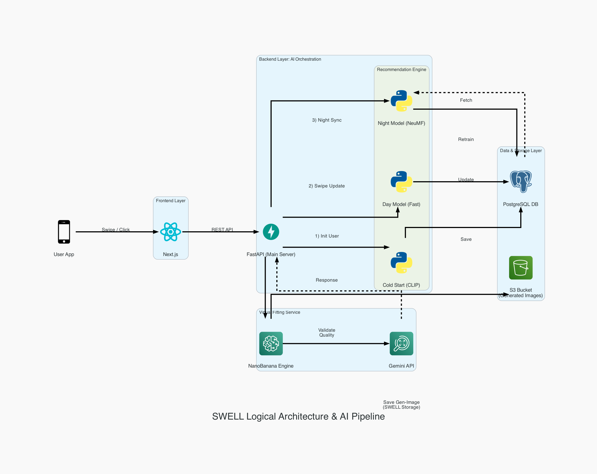

# SWELL Logical Architecture & AI Pipeline

> **다이어그램 생성:** 이 문서에 대응하는 아키텍처 다이어그램은 [swell_logical.py](./swell_logical.py)를 실행하면 생성된다.



---

## 1. 전체 구조 개요

SWELL은 **4개의 레이어**로 구성된 풀스택 AI 서비스이다.

| 레이어 | 구성 요소 | 역할 |
| :--- | :--- | :--- |
| **Frontend Layer** | Next.js | 사용자 인터페이스 (스와이프, 클릭 등 상호작용) |
| **Backend Layer** | FastAPI + Recommendation Engine | API 서버 + AI 추천 파이프라인 오케스트레이션 |
| **Virtual Fitting Service** | NanoBanana Engine + Gemini API | 가상 피팅 이미지 생성 + 품질 검증 |
| **Data & Storage Layer** | PostgreSQL + S3 | 사용자/아이템/벡터 데이터 저장 + 생성 이미지 저장 |

---

## 2. 데이터 흐름 (Flow)

### 사용자 → 프론트엔드 → 백엔드

```
User App  →  Next.js  →  FastAPI (Main Server)
          Swipe/Click    REST API
```

- 사용자가 앱에서 **스와이프(좋아요/싫어요)** 또는 **클릭** 액션을 수행한다.
- Next.js 프론트엔드가 해당 이벤트를 REST API로 FastAPI 백엔드에 전달한다.

---

## 3. 추천 엔진 (Recommendation Engine)

FastAPI는 사용자 상태에 따라 **3가지 추천 모델**을 순차적으로 오케스트레이션한다.

### 3-1. Cold Start (CLIP) — 신규 사용자 초기 추천

```
FastAPI  →  Cold Start (CLIP)  →  PostgreSQL DB
         1) Init User              Save
```

| 항목 | 설명 |
| :--- | :--- |
| **트리거** | 신규 사용자 가입 시 |
| **모델** | CLIP (Contrastive Language-Image Pre-Training) |
| **동작** | 사용자의 초기 선호도를 벡터로 변환하여 DB에 저장 |
| **목적** | 스와이프 데이터가 없는 신규 사용자에게도 즉시 추천 제공 |

### 3-2. Day Model (Fast) — 실시간 선호도 반영

```
FastAPI  →  Day Model (Fast)  →  PostgreSQL DB
         2) Swipe Update           Update
```

| 항목 | 설명 |
| :--- | :--- |
| **트리거** | 사용자가 스와이프할 때마다 (실시간) |
| **모델** | 경량 추천 모델 (빠른 응답 우선) |
| **동작** | 스와이프 피드백을 즉시 반영하여 사용자 선호도 벡터를 업데이트 |
| **목적** | 실시간으로 변하는 취향을 빠르게 추천에 반영 |

### 3-3. Night Model (NeuMF) — 정밀 재학습

```
PostgreSQL DB  →  Night Model (NeuMF)  →  PostgreSQL DB
               Fetch (dashed)              Retrain
```

| 항목 | 설명 |
| :--- | :--- |
| **트리거** | 야간 배치 작업 (Night Sync) |
| **모델** | NeuMF (Neural Matrix Factorization) |
| **동작** | 하루 동안 축적된 전체 사용자 데이터를 DB에서 Fetch하여 모델을 재학습(Retrain)하고, 갱신된 추천 결과를 DB에 다시 저장 |
| **목적** | 정밀도가 높은 딥러닝 모델로 추천 품질을 주기적으로 개선 |

---

## 4. 가상 피팅 서비스 (Virtual Fitting Service)

```
FastAPI  →  NanoBanana Engine  →  Gemini API  →  FastAPI
         Try-on Req           Validate Quality    Response (dashed)
                    \
                     → S3 Bucket (Save Gen-Image)
```

| 단계 | 구성 요소 | 설명 |
| :--- | :--- | :--- |
| **요청** | FastAPI → NanoBanana Engine | 사용자가 선택한 의류를 가상으로 착용한 이미지 생성을 요청 |
| **생성** | NanoBanana Engine | AI 기반 가상 피팅 이미지를 생성 |
| **검증** | NanoBanana → Gemini API | 생성된 이미지의 품질을 Gemini API로 검증 (부자연스러운 결과 필터링) |
| **저장** | NanoBanana → S3 Bucket | 최종 생성 이미지를 S3에 저장 |
| **응답** | Gemini API → FastAPI | 검증 결과를 백엔드에 반환하여 사용자에게 전달 |

---

## 5. 데이터 & 스토리지 레이어

| 스토리지 | 저장 데이터 | 접근 주체 |
| :--- | :--- | :--- |
| **PostgreSQL DB** | 사용자 정보, 아이템 메타데이터, 추천 벡터, 스와이프 이력 | Cold Start, Day Model, Night Model |
| **S3 Bucket** | 가상 피팅 생성 이미지 | NanoBanana Engine (쓰기), Frontend (읽기) |

---

## 6. 핵심 설계 철학

### 3단계 추천 전략 (Cold → Day → Night)

```
신규 가입 → CLIP으로 즉시 추천 (Cold Start)
    ↓
스와이프 → 실시간 선호도 반영 (Day Model)
    ↓
야간   → 정밀 딥러닝 재학습 (Night Model)
```

- **Cold Start**: 데이터가 없는 신규 사용자도 즉시 서비스 이용 가능
- **Day Model**: 사용자가 느끼는 추천 반응 속도를 최적화
- **Night Model**: 시간이 걸리지만 정밀도 높은 모델로 전체 품질 향상

이 3단계 구조를 통해 **"빠르게 시작하고, 실시간으로 적응하며, 주기적으로 정밀 개선"**하는 추천 파이프라인을 구현한다.
