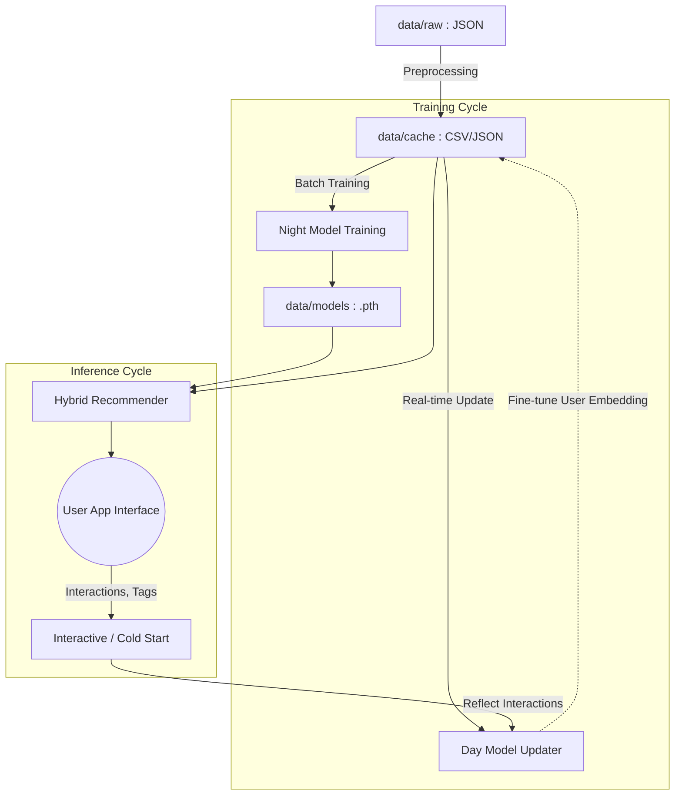

# SWELL Data & Recommendation Engine

> **Note:** All modules and data pipelines in this directory are fully integrated into the `backend/` service.

This directory serves as the core repository for the data pipelines and recommendation algorithms within SWELL. It follows standard MLOps directory structures, dividing files into raw data, pre-processed cache, trained model weights, and source code.

## 🗂 Directory Structure

```text
data/
├── README.md               # Overview of the data/ directory (This file)
├── raw/                    # [Raw Data] Unprocessed original files (JSON, etc.)
├── cache/                  # [Cached Data] Pre-processed embeddings (CSV, JSON) for quick consumption
├── models/                 # [Model Weights] PyTorch model checkpoints (.pth)
└── src/                    # [Core Logic] Recommendation engine, training scripts, and architectures
    ├── inference/          # Inference logic (Cold Start, Interactive Updates, Hybrid System)
    ├── training/           # Batch training pipelines (Day/Night model updates)
    └── models/             # PyTorch model definitions (NeuMF, BPR Loss, Loaders)
```

## 🔄 Recommendation Pipeline

The recommendation system consists of two primary cycles: **Training** and **Inference**.



### Key Components

1. **Data Caching (`raw` → `cache`)**
   - Extracts and computes text/image embeddings from the original JSONs. Caching these results significantly reduces latency during inference.

2. **Night Model Pipeline (Base Retraining)**
   - `src/training/night_model_training.py`
   - Utilizes NeuMF (Neural Matrix Factorization) optimized with BPR (Bayesian Personalized Ranking) Loss.
   - A heavy batch process that runs daily (usually at night) to retrain all model parameters using comprehensive user interaction history.

3. **Day Model Pipeline (Real-time Tuning)**
   - `src/training/day_model_update.py`
   - A lightweight process that only fine-tunes the user embedding vector.
   - Uses same-day interactions to swiftly capture and reflect shifting user preferences without retraining the entire model.

4. **Inference Services**
   - **Cold Start (`src/inference/cold_start.py`)**: Combines initial tags and favored outfits to establish a baseline embedding for new users.
   - **Interactive (`src/inference/interactive_recommendation.py`)**: Dynamically adjusts user coordinates based on real-time screen interactions (swipes, clicks).
   - **Hybrid (`src/inference/hybrid_recommendation.py`)**: Combines the robust item embeddings from the Night Model with real-time user embeddings from the Day Model to deliver the final Top-K recommendations.
